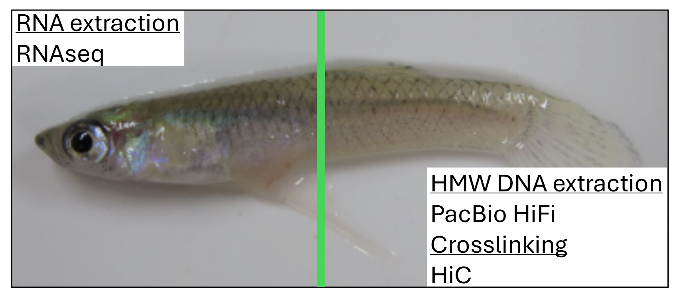

00 — Sample Collection, Nucleic Acid Extraction, and Sequencing
================

This section describes the sample collection, NA extraction, and
sequencing for the genome assembly of *Gambusia holbrooki* (eastern
mosquitofish).

## Sample Collection

A male *Gambusia holbrooki* adult was collected from Waterway Drive,
Townsville, Australia (−19.423°S, 146.698°E) in June 2024 and
transferred to the Marine and Aquaculture Research Facility at James
Cook University, Townsville, Australia, where it was acclimated in
freshwater at 27 °C. The male was kept with females from the same source
population and participated in breeding activities prior to euthanasia.

In March 2025, the chosen individual was euthanized in an ice bath and
immediately immersed in liquid nitrogen. At the time of euthanasia the
fish was approximately 30 mm in length and 0.2 g in weight. The sample
was stored at −80 °C before shipping to the Okinawa Institute of Science
and Technology (OIST) on dry ice.

------------------------------------------------------------------------

## Nucleic Acid Extraction

All extractions and library preparations were carried out at the OIST
Sequencing Section.

 ***Figure 0.1*** *The frozen fish
was cut into two pieces just posterior to the anal pore. The anterior
portion was used for RNA extraction and the posterior (tail muscle) was
used for HMW DNA extraction and chromatin crosslinking for Hi-C
sequencing.*

| Tissue | Application | Kit |
|:---|:---|:---|
| Anterior (whole body) | RNA extraction | Direct-zol RNA Kit (R2061, Zymo Research) |
| Posterior (tail muscle) | HMW DNA extraction | innuPREP Plant DNA I Kit (845-IPP-1516016, IST Innuscreen GmbH) |
| Posterior (tail muscle) | Chromatin crosslinking (Hi-C) | Disuccinimidyl Glutarate + Formaldehyde |

### Quality Control

| Analyte | Instrument | Kit |
|:---|:---|:---|
| RNA | TapeStation 4200 (Agilent) | RNA ScreenTape (5067-5576, Agilent) |
| HMW DNA | Femto Pulse (Agilent) | Genomic DNA 165 kb Kit (FP-1002, Agilent) |

------------------------------------------------------------------------

## Library Preparation and Sequencing

### Illumina (RNAseq + Hi-C)

| Library | Kit                                               |
|:--------|:--------------------------------------------------|
| RNAseq  | NEBNext Ultra II Directional RNA Library Prep Kit |
| Hi-C    | Dovetail® Omni-C Kit                              |

Both libraries were pooled and sequenced on a single lane of an Illumina
NovaSeq X Plus platform (1.5B, 300-cycle flow cell), producing
paired-end reads.

### PacBio HiFi

| Step                | Kit                    | Catalogue number |
|:--------------------|:-----------------------|:-----------------|
| Library preparation | SMRTbell® Prep Kit 3.0 | 102-141-700      |
| Sequencing cell     | Revio SMRT Cell        | 102-202-200      |
| Sequencing system   | PacBio Revio           | 102-090-600      |

HiFi reads were generated on a single Revio SMRT Cell.

------------------------------------------------------------------------

## Specimen Details

| Attribute           | Value                                 |
|:--------------------|:--------------------------------------|
| Species             | *Gambusia holbrooki* (Girard, 1859)   |
| Common name         | Eastern mosquitofish                  |
| Sex                 | Male                                  |
| Collection location | Waterway Drive, Townsville, Australia |
| Coordinates         | −19.423°S, 146.698°E                  |
| Collection date     | June 2024                             |
| Euthanasia date     | March 2025                            |
| Size at sequencing  | 25–30 mm, 0.1–0.2 g                   |
| NCBI BioProject     | PRJNA1450840                          |
| NCBI BioSample      | SAMN57172601                          |

------------------------------------------------------------------------

## NEXT STEP

The sequenced raw data was used in **[01 - Genome
Assembly](01_genome_assembly.md)**
