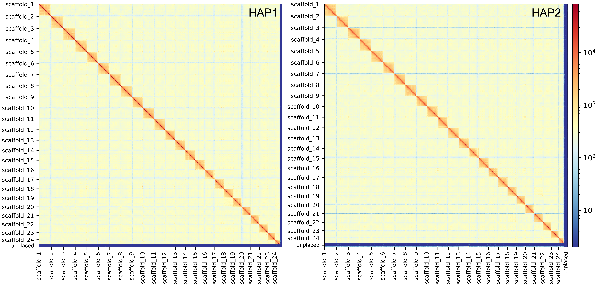

This section describes the Hi-C scaffolding pipeline applied to both phased assemblies (HAP1 and HAP2) from [01 — Genome Assembly](01_genome_assembly.md). Hi-C contact information is used to order and orient contigs into chromosome-scale scaffolds. All steps were run as SLURM array jobs processing both haplotypes in parallel.

---

## Inputs

| File | Description |
|---|---|
| mosquitofish.pbhic.asm1.hic.hap1.p_ctg.fa | HAP1 primary contigs from assembly |
| mosquitofish.pbhic.asm1.hic.hap2.p_ctg.fa | HAP2 primary contigs from assembly |
| Mosquitofish-HiC_S2_L001_R1_001.fastq.gz | Hi-C forward reads (SRR38065502) |
| Mosquitofish-HiC_S2_L001_R2_001.fastq.gz | Hi-C reverse reads (SRR38065501) |

---

## Software

| Tool | Version | Source |
|:---:|:---:|:---|
| bwa-mem2 | 2.2.1 | https://github.com/bwa-mem2/bwa-mem2 |
| samtools | 1.23.1 | https://github.com/samtools/samtools |
| pairtools | 1.1.3 | https://github.com/open2c/pairtools |
| YaHS | 1.2.2 | https://github.com/c-zhou/yahs |
| Juicer Tools | 1.22.01 | https://github.com/aidenlab/juicer |
| HiCExplorer | 3.7.6 | https://github.com/deeptools/HiCExplorer |
---

## Step 1 — Index Assemblies

Index both haplotype assemblies for BWA-MEM2 alignment and create FASTA index files.

```bash
# Run as SLURM array (0-1) to process HAP1 and HAP2 in parallel
bwa-mem2 index ${ASM}
samtools faidx ${ASM}
```

---

## Step 2 — Map Hi-C Reads

Map Hi-C reads to each assembly, convert to BAM, sort by read name, and clean up intermediates.

```bash
# Map Hi-C reads to assembly
bwa-mem2 mem -t 32 -5SP \
    ${ASM} \
    ${HIC_R1} \
    ${HIC_R2} \
    -o ${name}.sam

# Convert SAM to BAM, filtering low-quality alignments
samtools view -bS -F 2316 -@ 8 \
    ${name}.sam \
    -o ${name}.bam

# Sort BAM by read name (required for pairtools)
samtools sort -n -@ 8 -m 4G \
    ${name}.bam \
    -o ${name}.hic.bam

# Clean up intermediates
rm -f ${name}.sam ${name}.bam
```

**Notes:**
- The `-5SP` flags are specific to Hi-C data: `-5` reports the 5'-end alignment as primary for chimeric reads, `-S` skips mate rescue, and `-P` skips pair-end pairing. These flags prevent BWA from trying to resolve Hi-C chimeric reads as standard paired-end reads, which would result in incorrect mapping.

- `-F 2316` filters out unmapped reads, non-primary alignments, and supplementary alignments at the SAM conversion stage, reducing file size before sorting.

- Sorting by read name (`-n`) rather than coordinate is required by pairtools, which processes read pairs together.

- SAM and unsorted BAM intermediates are removed after each step to manage disk space. 

---

## Step 3 — Hi-C Pair Processing with Pairtools

Parse alignments into read pairs, sort, de-duplicate, and filter for valid Hi-C contacts.

```bash
# Parse BAM into pairs format and sort
pairtools parse \
    --min-mapq 40 \
    --walks-policy 5unique \
    --max-inter-align-gap 30 \
    --nproc-in 8 \
    --nproc-out 8 \
    --chroms-path ${ASM}.fai \
    ${name}.hic.bam \
    | pairtools sort \
    --nproc 16 \
    --tmpdir ${OUT_DIR} \
    -o ${name}.sorted.pairs.gz

# Mark and remove PCR duplicates
pairtools dedup \
    --nproc-in 8 \
    --nproc-out 8 \
    --mark-dups \
    --output-stats ${name}.dedup.stats \
    -o ${name}.dedup.pairs.gz \
    ${name}.sorted.pairs.gz

# Filter for valid Hi-C pairs (unique-unique and unique-rescued)
pairtools select \
    '(pair_type == "UU") or (pair_type == "UR") or (pair_type == "RU")' \
    --output-rest ${name}.invalid.pairs.gz \
    -o ${name}.valid.pairs.gz \
    ${name}.dedup.pairs.gz

# Remove intermediate sorted pairs file
rm -f ${name}.sorted.pairs.gz
```

**Notes:**
- `--min-mapq 40` retains only high-confidence alignments. This is a standard threshold for Hi-C scaffolding; lower values risk incorporating mismapped reads that create false contacts between non-adjacent regions.

- `--walks-policy 5unique` handles chimeric reads (reads spanning ligation junctions) by keeping only cases where the 5'-most alignment is uniquely mapped. This is appropriate for proximity-ligation libraries.

- `--max-inter-align-gap 30` sets the maximum gap between split alignments on the same read to be considered part of the same chimeric alignment rather than independent contacts.

- The deduplication step is critical for Hi-C — PCR duplicates artificially inflate contact frequencies at certain loci and bias scaffolding. `--output-stats` produces a summary of duplication rates that is worth checking.

- The `pairtools select` filter retains `UU` (both reads uniquely mapped), `UR`, and `RU` (one uniquely mapped, one rescued) pair types. Pairs where either read is multi-mapped or unmapped are discarded as they cannot reliably inform contact frequencies.


---

## Step 4 — Scaffolding with YaHS

Convert valid pairs to BAM format and run YaHS to generate chromosome-scale scaffolds.

```bash
# Convert valid pairs to BAM for YaHS input
pairtools split \
    --output-sam ${name}.valid.bam \
    ${name}.valid.pairs.gz

# Sort BAM by read name
samtools sort -n -@ 16 -m 4G \
    ${name}.valid.bam \
    -o ${name}.valid.nsorted.bam

rm -f ${name}.valid.bam

# Run YaHS scaffolding
yahs \
    ${ASM} \
    ${name}.valid.nsorted.bam \
    -q 10 \
    -o ${name}_yahs
```

**Notes:**
- YaHS (Yet Another Hi-C Scaffolder) uses a graph-based approach to order and orient contigs. It is well-suited to phased assemblies and handles the large contig N50 values typical of HiFiasm output.

- `-q 10` sets the minimum mapping quality for contacts used in scaffolding. This is a more permissive threshold than the `--min-mapq 40` used in pairtools parsing. 

- YaHS outputs a `.bin` contact file, an `.agp` file describing scaffold construction, and the final scaffolded FASTA (`_scaffolds_final.fa`). All three are needed for the contact map QC step.

---

## Step 5 — Contact Map QC with Juicer

Generate a `.hic` contact map file for visual inspection of scaffolding quality in Juicebox.

```bash
# Index the scaffolded assembly
samtools faidx ${name}_yahs_scaffolds_final.fa

# Build chromosome sizes file
awk 'BEGIN{OFS="\t"}{print $1,$2}' \
    ${name}_yahs_scaffolds_final.fa.fai \
    > ${name}.chrom.sizes

# Generate sorted alignments with juicer pre
juicer pre \
    ${name}_yahs.bin \
    ${name}_yahs_scaffolds_final.agp \
    ${ASM}.fai \
    | sort -k2,2d -k6,6d -T ${OUT_DIR} --parallel=16 -S 32G \
    | awk 'NF' \
    > ${name}_alignments_sorted.txt

# Generate .hic contact map
java -Xmx32G -jar juicer_tools_1.22.01.jar pre \
    ${name}_alignments_sorted.txt \
    ${name}.hic \
    ${name}.chrom.sizes
```

Using the `.hic` contact map to plot the contact map with HiCExplorer.
```bash
# Convert .hic to .cool format at 1 Mb resolution
hicConvertFormat \
    -m mosquito.pbhic.asm1.hic.hap1.p_ctg.hic \
    -o mosquito.hap1.cool \
    --inputFormat hic \
    --outputFormat cool \
    --resolutions 1000000

# Plot contact map — top 24 chromosomes only
hicPlotMatrix \
    -m mosquito.hap1_1000000.cool \
    -out mosquito.hap1_top24.svg \
    --log1p \
    --clearMaskedBins \
    --chromosomeOrder \
        scaffold_1 scaffold_2 scaffold_3 scaffold_4 scaffold_5 scaffold_6 \
        scaffold_7 scaffold_8 scaffold_9 scaffold_10 scaffold_11 scaffold_12 \
        scaffold_13 scaffold_14 scaffold_15 scaffold_16 scaffold_17 scaffold_18 \
        scaffold_19 scaffold_20 scaffold_21 scaffold_22 scaffold_23 scaffold_24 \
    --rotationX 90 \
    --fontsize 8 \
    --increaseFigureWidth 1.0 \
    --increaseFigureHeight 0.8
```

**Notes:**
- `juicer pre` uses the YaHS `.bin` contact file and `.agp` scaffold description to reconstruct contacts in the coordinate space of the final scaffolded assembly. The original contig-level `.fai` is also required to map contacts back correctly.

- The intermediate sort step (`sort -k2,2d -k6,6d`) reorders contacts by chromosome and position, which is required by `juicer_tools pre` to build the `.hic` format efficiently. `awk 'NF'` removes any empty lines that would cause parsing errors.

- The resulting `.hic` file can also e loaded directly into [Juicebox](https://www.aidenlab.org/juicebox/) for visual QC. A well-scaffolded chromosome-scale assembly should show strong signal along the diagonal with clear block structure corresponding to chromosomes.


***Figure 2.1*** *Hi-C contact maps for HAP1 (left) and HAP2 (right). Strong signal along the diagonal confirms correct chromosome-scale scaffolding across all 24 chromosomes. Off-diagonal signal is minimal, indicating clean separation between chromosomes with no major misassemblies. The unplaced contig bin (bottom/right) shows low contact frequency with the chromosomal scaffolds as expected.*

---

## Outputs

| File | Description |
|---|---|
| `*_yahs_scaffolds_final.fa` | Chromosome-scale scaffolded assembly (HAP1 and HAP2) |
| `*_yahs.bin` | YaHS binary contact file |
| `*_yahs_scaffolds_final.agp` | Scaffold construction description (AGP format) |
| `*.hic` | Juicebox contact map for visual QC |
| `*.dedup.stats` | Pairtools deduplication statistics |

---
## NEXT STEP

Scaffolded assemblies are passed to **[03 — Assembly and Scaffolding QC](03_assembly_and_scaffolding_QC.md)**.


