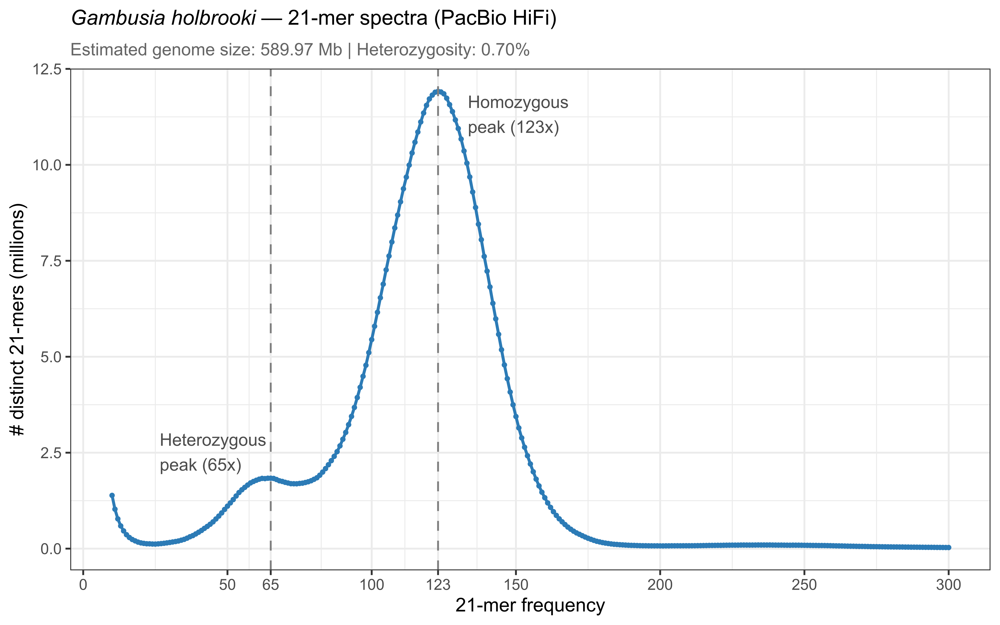
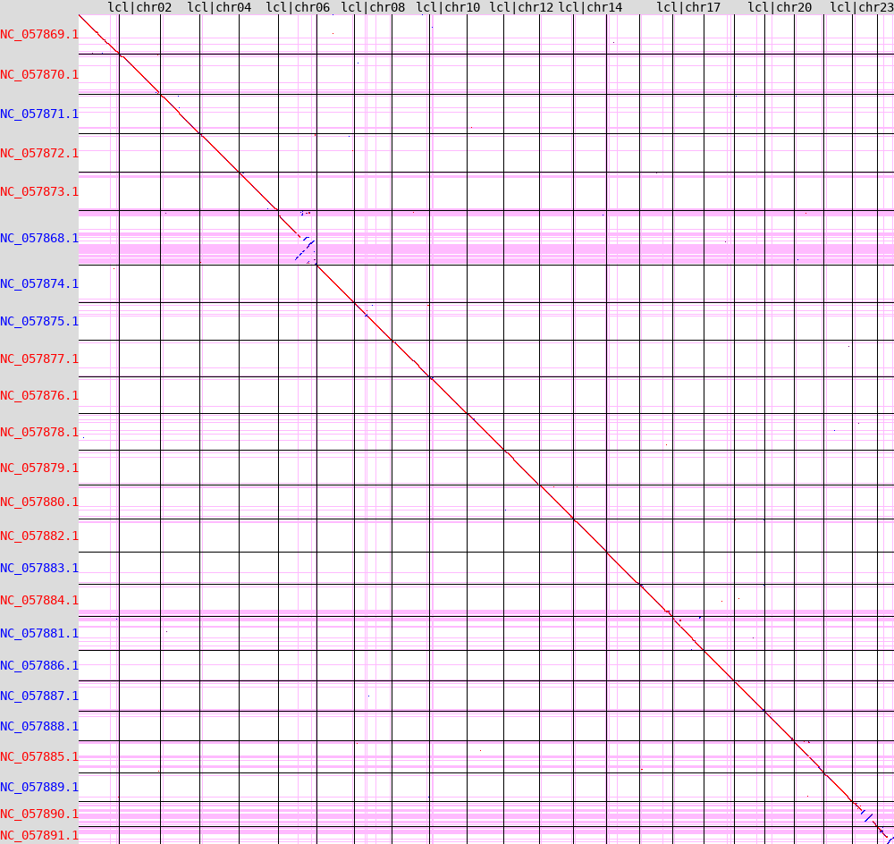

03 — Assembly and Scaffolding Quality Control
================

This section describes the quality assessment of both the raw contig
assemblies from [01 — Genome Assembly](01_genome_assembly.md) and the
scaffolded assemblies from [02 — Hi-C
Scaffolding](02_HiC_scaffolding.md). QC was performed using KAT (k-mer
analysis and genome size estimation), BUSCO (gene space completeness),
QUAST (assembly contiguity statistics), Merqury (k-mer-based quality
value and completeness), tidk (telomere identification), and seqtk (gap
analysis). FCS-adaptor was used to screen for adaptor contamination
prior to NCBI submission.

------------------------------------------------------------------------

## Software

| Tool | Version | Source |
|:--:|:--:|:---|
| KAT | 2.4.2 | <https://github.com/TGAC/KAT> |
| BUSCO | 5.1.3 | <https://busco.ezlab.org> |
| FCS-adaptor | 0.5.5 | <https://github.com/ncbi/fcs> |
| QUAST | 5.0.2 | <https://github.com/ablab/quast> |
| Meryl | 1.4.1 | <https://github.com/marbl/meryl> |
| Merqury | commit 1ad7c32 | <https://github.com/marbl/merqury> |
| tidk | 0.2.65 | <https://github.com/tolkit/telomeric-identifier> |
| seqtk | 1.4-2 | <https://github.com/lh3/seqtk> |

------------------------------------------------------------------------

## Step 1 — KAT k-mer Analysis

K-mer frequency analysis of the raw HiFi reads to estimate genome size
and heterozygosity prior to assembly.

``` bash
kat hist -m 21 \
    -o pbhifi_k21 \
    m84168_260317_052632_s4.fastq.gz
```

**Notes:** - KAT generates a k-mer frequency histogram from the raw
reads, which can be used to estimate genome size (from the area under
the curve) and heterozygosity (from the ratio of the heterozygous to
homozygous peak heights).

- k=21 is standard for HiFi reads; smaller values increase sensitivity
  to low-complexity regions, larger values increase specificity.

- The histogram is useful for identifying contamination (unexpected
  secondary peaks) and assessing coverage uniformity before committing
  to assembly.

### Results

| Metric                   |   Value   |
|:-------------------------|:---------:|
| Estimated genome size    | 589.97 Mb |
| Estimated heterozygosity |   0.70%   |

The estimated genome size is consistent with final assembly sizes (~676
Mb HAP1, ~674 Mb HAP2) after accounting for the diploid nature of the
reads; the KAT estimate reflects the haploid genome size. Heterozygosity
of 0.70% is moderate and consistent with successful phased diploid
assembly by HiFiasm.

 ***Figure 3.1***
*21-mer frequency spectra of PacBio HiFi reads. The heterozygous peak
(~68x) and homozygous peak (~123x) are consistent with a diploid genome
at ~123x haploid coverage and 0.70% heterozygosity.*

------------------------------------------------------------------------

## Step 2 — BUSCO Gene Completeness

BUSCO assesses gene space completeness by searching for conserved
single-copy orthologs from the `actinopterygii_odb10` lineage dataset
(3,640 BUSCOs). Run as SLURM array jobs processing HAP1 and HAP2 in
parallel, for both raw contigs and scaffolded assemblies.

``` bash
# Run as SLURM array (0-1) for HAP1 and HAP2
busco -m genome \
      -i ${assembly} \
      -c 16 \
      -l actinopterygii_odb10 \
      -o ${name} \
      --download_path /flash/RavasiU/Roger/BUSCO_DB/busco_downloads \
      -f
```

**Notes:** - `-m genome` runs BUSCO in genome mode, which uses Augustus
for ab initio gene prediction seeded by BUSCO orthologs.

- `actinopterygii_odb10` is the ray-finned fish lineage dataset, the
  most appropriate for *Gambusia holbrooki*.

- BUSCO scores are expected to remain essentially unchanged between
  contigs and scaffolds since scaffolding reorganises but does not add
  or remove sequence. Any reduction in completeness after scaffolding
  would indicate a scaffolding error.

### Results

| Assembly | Complete (C) | Single (S) | Duplicated (D) | Fragmented (F) | Missing (M) | n |
|:---|:--:|:--:|:--:|:--:|:--:|:--:|
| HAP1 contigs | 98.7% | 97.8% | 0.9% | 0.3% | 1.0% | 3640 |
| HAP2 contigs | 98.4% | 97.5% | 0.9% | 0.3% | 1.3% | 3640 |
| HAP1 scaffolds | 98.6% | 97.8% | 0.8% | 0.3% | 1.1% | 3640 |
| HAP2 scaffolds | 98.4% | 97.5% | 0.9% | 0.3% | 1.3% | 3640 |

BUSCO completeness is consistently high (≥98.4%) across both haplotypes
and both assembly stages, with negligible change between contigs and
scaffolds as expected. Duplication rates (~0.9%) are low, indicating
clean haplotype separation by HiFiasm.

------------------------------------------------------------------------

## Step 3 — QUAST Assembly Statistics

QUAST computes standard assembly contiguity metrics. Run as SLURM array
jobs for both haplotypes at both assembly stages.

``` bash
# Run as SLURM array (0-1) for HAP1 and HAP2
quast -o ${name}_quast \
      -t 6 \
      ${assembly}
```

**Notes:** - QUAST was run without a reference genome (`-r`), so metrics
are reference-free. Comparative metrics against a reference would
require a closely related chromosome-scale assembly.

- The key contiguity metrics to evaluate are N50 (length at which 50% of
  the assembly is in contigs/scaffolds of this size or larger), scaffold
  count, and largest contig/scaffold.

- N50 is expected to increase substantially after scaffolding as contigs
  are joined into chromosome-scale scaffolds.

- N’s per 100 kbp reports the gap content introduced by scaffolding
  (gaps are filled with Ns). A very low value indicates few or no
  artificial gaps.

### Results — Raw Contigs and Scaffolded Assemblies

| Metric | HAP1 contigs | HAP1 scaffolds | HAP2 contigs | HAP2 scaffolds |
|:---|---:|---:|---:|---:|
| Number of sequences | 105 | 92 | 105 | 105 |
| Total length | 676,086,460 bp | 676,090,160 bp | 674,278,445 bp | 674,281,745 bp |
| Largest sequence | 33,525,988 bp | 34,190,813 bp | 32,188,009 bp | 33,349,100 bp |
| N50 | 26,036,085 bp | 30,244,266 bp | 26,644,925 bp | 29,216,239 bp |
| N75 | 18,159,146 bp | 25,764,457 bp | 17,386,372 bp | 25,759,159 bp |
| L50 | 12 | 11 | 12 | 11 |
| L75 | 20 | 17 | 20 | 17 |
| GC content | 39.0% | 39.0% | 39.0% | 39.0% |
| N’s per 100 kbp | 0.00 | 0.55 | 0.00 | 0.49 |

Scaffold N50 increased from ~26 Mb to ~30 Mb for HAP1 and from ~27 Mb to
~29 Mb for HAP2, reflecting successful chromosome-scale scaffolding.
HAP1 was reduced from 105 contigs to 92 scaffolds. HAP2 retained the
same count of 105, but the size distribution changed between contigs and
scaffolds, indicating that YaHS both joined some contigs and broke up
others (misassembly correction), resulting in an unchanged total count.
The more distinct size drop-off after chromosome 24 in the HAP2 scaffold
size distribution relative to the contigs suggests the Hi-C signal was
sufficiently informative to detect and correct putative misassemblies
(Figure 3.2). N content is negligible (\<1 N per 100 kbp), indicating
very few scaffolding gaps were introduced (see below).

 ***Figure 3.2***
*Contig and scaffold size distribution (top 70) for HAP1 and HAP2. The
red dashed line marks position 24, corresponding to the expected number
of chromosomes. Left of the line: chromosome-scale sequences. Right of
the line: unplaced contigs/scaffolds.*

------------------------------------------------------------------------

## Step 4 — Adaptor Contamination Screening with FCS-adaptor

NCBI’s FCS-adaptor tool was used to screen both scaffolded assemblies
for residual adaptor contamination prior to NCBI submission. Run after
scaffolding on the final assembly files.

This step resulted in the following files, which contained the 24
chromosomes as well as the unplaced contigs:
`gamhol_genome_hap1_final_clnd.fa` `gamhol_genome_hap2_final_clnd.fa`

``` bash
# HAP1
~/Software/run_fcsadaptor.sh \
    --fasta-input gamhol_genome_hap1_final.fa \
    --output-dir hap1_ncbi_filter \
    --euk \
    --container-engine singularity \
    --image ~/Software/fcs-adaptor.sif

# HAP2
~/Software/run_fcsadaptor.sh \
    --fasta-input gamhol_genome_hap2_final.fa \
    --output-dir hap2_ncbi_filter \
    --euk \
    --container-engine singularity \
    --image ~/Software/fcs-adaptor.sif
```

**Notes:** - `--euk` specifies eukaryotic mode, which applies the
appropriate adaptor library for eukaryotic genome submissions.

- FCS-adaptor is required by NCBI for genome submissions and checks for
  common sequencing adaptors, vector sequences, and linker contamination
  that may have been incorporated during library preparation.

- Results are written to the `--output-dir` and include a report of
  detected contamination and a cleaned FASTA if any contamination was
  found.

### Results

| Assembly | Contamination detected              | Action             |
|:---------|:------------------------------------|:-------------------|
| HAP1     | Minor adaptor contamination in chr4 | Removed            |
| HAP2     | None detected                       | No action required |

The cleaned HAP1 assembly (`hap1_ncbi_filter/`) was used for all
downstream annotation and submission steps.

**Reference:** <https://github.com/ncbi/fcs/wiki/FCS-adaptor-quickstart>

------------------------------------------------------------------------

## Step 5 — Merqury k-mer Quality Value

Merqury evaluates assembly quality by comparing k-mer content of the
assembly against the HiFi reads, producing a quality value (QV) and a
k-mer completeness score without requiring a reference genome.

### Step 4.1 — Build Meryl k-mer Database from Reads

``` bash
meryl count \
    k=21 \
    threads=32 \
    memory=180 \
    m84168_260317_052632_s4.fastq.gz \
    output reads.k21.meryl
```

**Notes:** - The Meryl k-mer database is built once from the HiFi reads
and reused for both HAP1 and HAP2 Merqury analyses.

- k=21 matches the KAT analysis for consistency. Merqury is relatively
  insensitive to k choice in this range for HiFi data.

### Step 4.2 — Run Merqury

``` bash
# Run in output directory with symlinked inputs
ln -sf ${ASSEMBLY} $(basename ${ASSEMBLY})
ln -sf ${READS_DB} $(basename ${READS_DB})

merqury.sh reads.k21.meryl \
           ${assembly} \
           PGA_k21
```

**Notes:** - Merqury requires running in its output directory with
inputs available as local symlinks or files. The script handles this
with `ln -sf`.

- Output includes a `.qv` file (per-sequence and overall QV), a
  `.completeness` file (k-mer completeness score), and spectra-copy
  number plots.

- QV is expressed on a Phred scale: QV67 corresponds to ~1 error per 5
  Mb, which is exceptional for a genome assembly. QV values above 50 are
  considered high quality for publication.

### Results

| Assembly | K-mers in reads | K-mers in assembly | Completeness |  QV   | Error rate  |
|:--------:|:---------------:|:------------------:|:------------:|:-----:|:-----------:|
|   HAP1   |   589,085,447   |    610,864,225     |    96.43%    | 67.99 | 1.59 × 10⁻⁷ |
|   HAP2   |   587,738,917   |    610,864,225     |    96.21%    | 66.84 | 2.07 × 10⁻⁷ |

Both haplotypes achieve QV \>66, indicating extremely high base-level
accuracy consistent with PacBio HiFi sequencing. K-mer completeness of
~96% reflects that a small proportion of read k-mers are absent from the
assembly, likely due to collapsed or unassembled repetitive regions.

------------------------------------------------------------------------

## Step 6 — Telomere Analysis (tidk)

Telomeric repeat identification was performed on the HAP1 assembly using
tidk v0.2.65 to assess chromosome-level assembly completeness.

``` bash
conda create -n tidk -c bioconda tidk
conda activate tidk

# Explore repeat unit (to confirm vertebrate canonical repeat)
tidk explore --minimum 5 --length 7 --maximum 12 \
    gamhol_genome_hap1_final_clnd.fa

# Search for vertebrate telomeric repeat (TTAGGG)
tidk search --string TTAGGG \
            --output gamhol_hap1 \
            --dir tidk_out_chr \
            gamhol_genome_hap1_final_clnd.fa

# Plot telomeric signal across chromosomes
tidk plot --tsv tidk_out_chr/gamhol_hap1_telomeric_repeat_windows.tsv \
          --output tidk_out_chr/gamhol_hap1_telomeres
```

**Notes:** - `tidk explore` was run first to confirm the canonical
vertebrate telomeric repeat unit (TTAGGG) is the dominant repeat at
chromosome ends, rather than a non-canonical variant.

- Telomeric signal is assessed per 10 kb window; a chromosome is
  considered to have telomeric signal at an end if the first or last
  window shows forward or reverse TTAGGG repeat counts above zero.

### Results

Telomeric signal was assessed at the first and last 10 kb window of each
chromosome. Signal counts represent the sum of forward and reverse
TTAGGG repeats per window. A threshold of 50 repeats per window was used
to distinguish strong from weak signal.

| Chromosome | HAP1 5’ | HAP1 3’ | HAP1 assessment | HAP2 5’ | HAP2 3’ | HAP2 assessment |
|:--:|:--:|:--:|:--:|:--:|:--:|:--:|
| chr01 | 428 | 87 | Strong both ends | 7 | 143 | Weak 5’, strong 3’ |
| chr02 | 384 | 444 | Strong both ends | 332 | 200 | Strong both ends |
| chr03 | 167 | 224 | Strong both ends | 810 | 274 | Strong both ends |
| chr04 | 619 | 168 | Strong both ends | 474 | 617 | Strong both ends |
| chr05 | 3 | 274 | Weak 5’, strong 3’ | 14 | 0 | Weak 5’, absent 3’ |
| chr06 | 202 | 29 | Strong 5’, weak 3’ | 308 | 47 | Strong 5’, weak 3’ |
| chr07 | 131 | 92 | Strong both ends | 7 | 23 | Weak both ends |
| chr08 | 509 | 39 | Strong 5’, weak 3’ | 162 | 2 | Strong 5’, absent 3’ |
| chr09 | 27 | 141 | Weak 5’, strong 3’ | 517 | 124 | Strong both ends |
| chr10 | 138 | 582 | Strong both ends | 4 | 150 | Weak 5’, strong 3’ |
| chr11 | 498 | 313 | Strong both ends | 16 | 9 | Weak both ends |
| chr12 | 9 | 335 | Weak 5’, strong 3’ | 94 | 0 | Strong 5’, absent 3’ |
| chr13 | 349 | 3 | Strong 5’, weak 3’ | 224 | 0 | Strong 5’, absent 3’ |
| chr14 | 521 | 939 | Strong both ends | 293 | 128 | Strong both ends |
| chr15 | 737 | 75 | Strong both ends | 371 | 583 | Strong both ends |
| chr16 | 350 | 44 | Strong 5’, weak 3’ | 239 | 661 | Strong both ends |
| chr17 | 604 | 527 | Strong both ends | 4 | 519 | Weak 5’, strong 3’ |
| chr18 | 241 | 1 | Strong 5’, absent 3’ | 16 | 2 | Weak both ends |
| chr19 | 300 | 2 | Strong 5’, absent 3’ | 329 | 89 | Strong both ends |
| chr20 | 2 | 0 | Weak 5’, absent 3’ | 703 | 35 | Strong 5’, weak 3’ |
| chr21 | 491 | 107 | Strong both ends | 467 | 0 | Strong 5’, absent 3’ |
| chr22 | 176 | 371 | Strong both ends | 441 | 470 | Strong both ends |
| chr23 | 177 | 0 | Strong 5’, absent 3’ | 2 | 455 | Weak 5’, strong 3’ |
| chr24 | 165 | 158 | Strong both ends | 516 | 321 | Strong both ends |

| Category               | HAP1 | HAP2 |
|:-----------------------|:----:|:----:|
| Strong both ends (≥50) |  13  |  10  |
| Strong/weak one end    |  9   |  7   |
| Absent at one end      |  1   |  3   |
| Weak/absent both ends  |  1   |  4   |

HAP1: All 24 chromosomes show detectable telomeric signal at at least
one end. 13 chromosomes have strong bilateral signal (≥50 repeats at
both ends). A further 9 chromosomes (chr05, chr06, chr08, chr09, chr12,
chr13, chr16, chr18, chr19) have a strong or weak signal at one end
paired with a weak, nonzero signal at the other. chr23 has strong 5’
signal but no detectable 3’ signal, while chr20 has only weak signal at
both ends (2 and 0 repeats), suggesting these two termini remain
unresolved.

HAP2: 10 chromosomes have strong bilateral signal. A further 7
chromosomes (chr01, chr06, chr08, chr10, chr17, chr20, chr23) have a
strong or weak signal at one end paired with a weak, nonzero signal at
the other. chr12, chr13, and chr21 have strong signal at one end but no
detectable signal at the other. chr05, chr07, chr11, and chr18 show only
weak or absent signal at both ends. The asymmetry between haplotypes
likely reflects differences in contig ordering and orientation
introduced during phased assembly.

 *<b>Figure
3.3a.</b> Telomeric repeat (TTAGGG) distribution across the 24 HAP1
chromosomes. Forward (top) and reverse (bottom) repeat counts per 10 kb
window.*

 *<b>Figure
3.3b.</b> Telomeric repeat (TTAGGG) distribution across the 24 HAP2
chromosomes. Forward (top) and reverse (bottom) repeat counts per 10 kb
window.*

------------------------------------------------------------------------

## Step 7 — Gap Analysis

Gap content (N bases) in the final HAP1 assembly was assessed using
`seqtk comp`, which reports per-sequence base composition including N
counts. The final scaffolded assembly was reduced to the 24 chromosomes
for this analysis.

``` bash
seqtk comp gamhol_genome_hap1_24chr.fa

seqtk comp gamhol_genome_hap2_24chr.fa
```

### Results

| Chromosome | HAP1 length (bp) | HAP1 N bases | HAP1 joins | HAP2 length (bp) | HAP2 N bases | HAP2 joins |
|:--:|:--:|:--:|:--:|:--:|:--:|:--:|
| chr01 | 34,190,813 | 400 | 4 | 33,349,100 | 100 | 1 |
| chr02 | 33,525,988 | 0 | 0 | 32,283,313 | 200 | 2 |
| chr03 | 32,476,668 | 100 | 1 | 32,188,009 | 0 | 0 |
| chr04 | 32,171,369 | 100 | 1 | 32,149,193 | 100 | 1 |
| chr05 | 32,058,858 | 0 | 0 | 31,980,053 | 200 | 2 |
| chr06 | 31,487,605 | 300 | 3 | 31,181,643 | 100 | 1 |
| chr07 | 31,044,878 | 100 | 1 | 30,790,194 | 0 | 0 |
| chr08 | 30,754,752 | 400 | 4 | 30,080,000 | 0 | 0 |
| chr09 | 30,580,987 | 100 | 1 | 29,851,100 | 100 | 1 |
| chr10 | 30,557,962 | 200 | 2 | 29,739,514 | 100 | 1 |
| chr11 | 30,244,266 | 0 | 0 | 29,216,239 | 0 | 0 |
| chr12 | 28,954,000 | 0 | 0 | 28,890,128 | 500 | 5 |
| chr13 | 28,156,353 | 200 | 2 | 28,180,777 | 300 | 3 |
| chr14 | 27,429,765 | 200 | 2 | 27,634,116 | 200 | 2 |
| chr15 | 27,035,568 | 300 | 3 | 26,886,851 | 200 | 2 |
| chr16 | 26,702,060 | 200 | 2 | 26,644,925 | 0 | 0 |
| chr17 | 25,764,457 | 100 | 1 | 25,759,159 | 200 | 2 |
| chr18 | 25,082,092 | 200 | 2 | 24,976,037 | 0 | 0 |
| chr19 | 24,907,109 | 100 | 1 | 24,670,815 | 100 | 1 |
| chr20 | 24,111,573 | 100 | 1 | 24,188,618 | 100 | 1 |
| chr21 | 24,011,866 | 200 | 2 | 24,087,629 | 300 | 3 |
| chr22 | 23,523,470 | 100 | 1 | 23,446,871 | 100 | 1 |
| chr23 | 19,880,911 | 100 | 1 | 20,104,889 | 200 | 2 |
| chr24 | 13,183,399 | 200 | 2 | 13,295,095 | 200 | 2 |

**Notes:** - Each 100 bp gap corresponds to one scaffolding join
introduced by YaHS, where contigs were joined with a 100 N spacer.

- HAP1: 4 chromosomes (chr02, chr05, chr11, chr12) contain zero Ns —
  assembled as single contigs. chr01 and chr08 have the most joins (4
  each). Total gap content: 3,700 bp (37 joins).

- HAP2: 6 chromosomes (chr03, chr07, chr08, chr11, chr16, chr18) contain
  zero Ns. chr12 has the most joins (5). Total gap content: 3,300 bp (33
  joins).

- Both assemblies show low gap content, consistent with the QUAST N per
  100 kbp values of 0.55 (HAP1) and 0.49 (HAP2).

------------------------------------------------------------------------

## Step 8 — Comparative Synteny (Whole-Genome Alignment)

Whole-genome alignments were performed using nf-core/pairgenomealign to
assess synteny and structural concordance between HAP1 and (i) HAP2,
(ii) the ERGA-BGE *G. holbrooki* reference assembly (GCA_965282415.1),
and (iii) the *G. affinis* assembly (GCF_019740435.1).

``` bash
ml nf-core/3.5.2
ml Nextflow2/25.10.4

nextflow run nf-core/pairgenomealign \
    --target <HAP1 fasta> \
    --input <samplesheet>.csv \
    --outdir results_comparative \
    -c custom.config \
    -profile oist \
    --dotplot_filter \
    --seed RY128 \
    -bg
```

### Summary

| Comparison                  | Chromosomes with inversions |
|-----------------------------|-----------------------------|
| HAP1 vs HAP2                | chr24                       |
| HAP1 vs G. holbrooki (ERGA) | chr23, chr24                |
| HAP1 vs G. affinis          | chr6, chr23, chr24          |

**Notes:**

- HAP1 used as alignment target throughout; HAP2, G. holbrooki (ERGA),
  and G. affinis aligned as queries.

- `--dotplot_filter` retains one-to-one alignment blocks only.

- Aside from these localized terminal inversions, all comparisons showed
  complete one-to-one chromosome-scale synteny.

- chr23/chr24 inversions recur across independently generated assemblies
  (this study’s own haplotype pair plus two external species),
  suggesting these may be genuine structural features rather than
  assembly artifacts.

### Synteny Dot Plots


**Figure 3.4a.** *HAP1 self-alignment (reference diagonal).*


**Figure 3.4b.** *HAP1 vs HAP2.*


**Figure 3.4c.** *HAP1 vs G. holbrooki (ERGA-BGE, Italy).*


**Figure 3.4d.** *HAP1 vs G. affinis.*

------------------------------------------------------------------------

## Summary

| Metric                         |       HAP1       |       HAP2       |
|:-------------------------------|:----------------:|:----------------:|
| Estimated genome size (KAT)    |    589.97 Mb     |        —         |
| Heterozygosity (KAT)           |      0.70%       |        —         |
| Number of scaffolds            |        92        |       105        |
| Total assembly length          |     676.1 Mb     |     674.3 Mb     |
| Number of chromosomes          |        24        |        24        |
| Chromosome-scale sequence      | 667.8 Mb (98.8%) | 661.6 Mb (98.1%) |
| Unplaced sequence              |  8.3 Mb (1.2%)   |  12.7 Mb (1.9%)  |
| Scaffold N50                   |     30.2 Mb      |     29.2 Mb      |
| BUSCO completeness (scaffolds) |      98.6%       |      98.4%       |
| Merqury QV                     |      67.99       |      66.84       |
| Merqury completeness           |      96.43%      |      96.21%      |
| Total gap content              |     3,700 bp     |     3,300 bp     |
| Scaffolding joins              |        37        |        33        |

After assembly and scaffolding QC, the next step included **[04 - Repeat
Annotation](04_repeat_annotation.md)**
