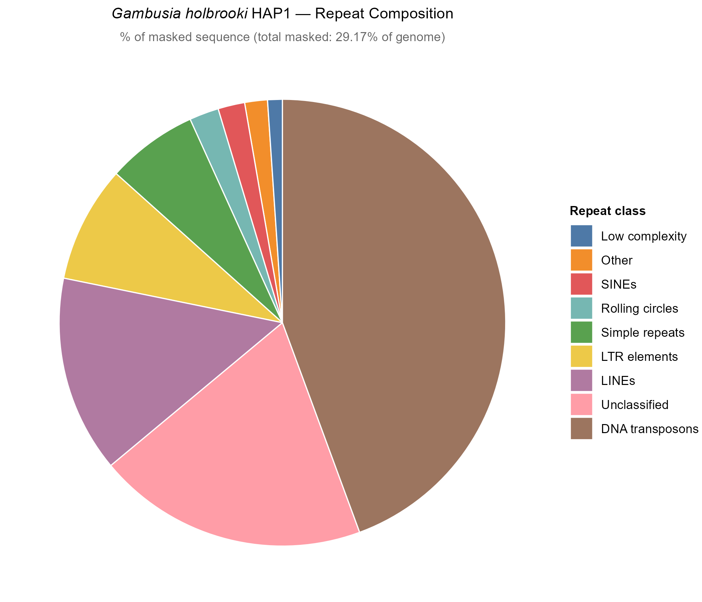
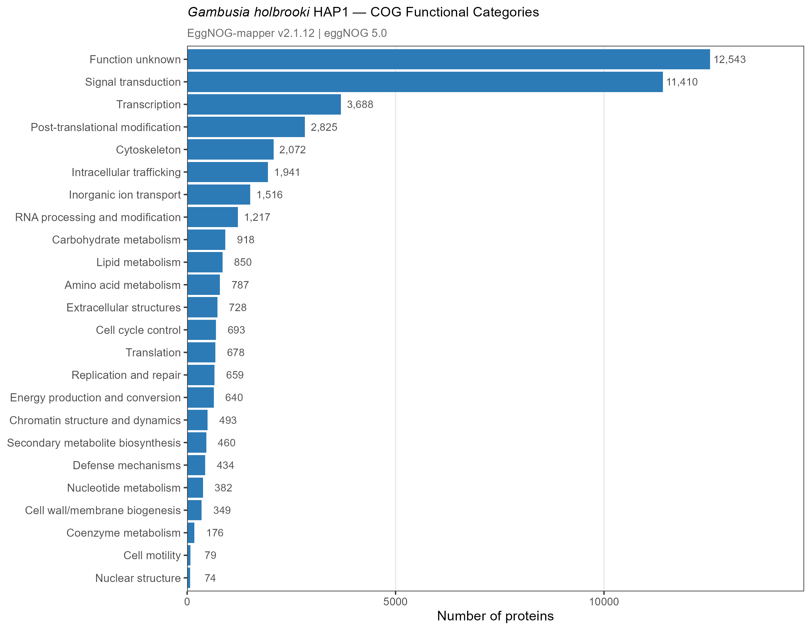

06 — Annotation Quality Control
================

This section describes quality assessment of the genome annotation for
*Gambusia holbrooki* HAP1, covering structural annotation statistics
from EGAPx, masking statistics, and functional annotation coverage from
EggNOG-mapper.

> **Note:** HAP2 annotation QC will be added once EGAPx completes for
> HAP2.

------------------------------------------------------------------------

## Part 1 — Masking Statistics

EGAPx reports the proportion of the assembly masked by WindowMasker
during the annotation process.

|        Metric        | HAP1  |
|:--------------------:|:-----:|
| WindowMasker masking | 28.6% |

**Notes:**

- WindowMasker is NCBI’s repeat masking tool used internally by EGAPx.
  The 28.6% masking rate is consistent with the repeat content expected
  for a teleost fish genome and broadly in line with the RepeatMasker
  results from [04 — Repeat Annotation](04_repeat_annotation.md).

- This value reflects masking applied during gene prediction and does
  not replace the more comprehensive RepeatMasker annotation.

------------------------------------------------------------------------

## Part 2 — Protein BUSCO Assessment

EGAPx ran BUSCO v5.7.1 in protein mode on the predicted proteins
(`actinopterygii_odb10`, 3,640 BUSCOs).

| Assembly | Complete (C) | Single (S) | Duplicated (D) | Fragmented (F) | Missing (M) | n |
|:---|:--:|:--:|:--:|:--:|:--:|:--:|
| HAP1 proteins | 99.3% | 98.3% | 1.0% | 0.4% | 0.3% | 3,640 |

**Notes:**

- Protein-mode BUSCO assesses annotation completeness independently of
  the assembly. It asks whether the predicted gene models capture the
  expected conserved gene space, rather than whether the conserved genes
  are present in the assembly sequence.

- HAP1 protein BUSCO (99.3%) is slightly higher than the genome-mode
  BUSCO (98.6%), which is expected: genome BUSCO finds conserved genes
  in the assembly sequence, while protein BUSCO confirms they are
  correctly annotated as complete gene models.

- Missing BUSCOs dropped from 1.1% (genome) to 0.3% (proteins),
  indicating that EGAPx successfully annotated nearly all conserved
  genes present in the assembly.

- Duplication (1.0%) is low and consistent with the genome-mode result,
  confirming clean haplotype separation was maintained through
  annotation.

------------------------------------------------------------------------

## Part 3 — Structural Annotation Statistics

Gene and transcript counts from EGAPx `feature_counts.txt` and
`feature_stats.xml`.

### Gene and Transcript Counts

| Feature                          |     Count      |
|:---------------------------------|:--------------:|
| Total genes                      |     24,433     |
| Protein-coding genes             |     22,780     |
| Non-coding RNA genes             |     1,231      |
| Pseudogenes (non-transcribed)    |      353       |
| Genes with variants (isoforms)   |     9,475      |
| Partial genes                    |       30       |
| Ig/TCR segment genes             |       69       |
| Total mRNAs                      |     43,928     |
| mRNAs fully supported by RNA-seq | 42,724 (97.3%) |
| mRNAs ab initio \>5%             |   678 (1.5%)   |
| Non-coding RNAs                  |     2,811      |
| Pseudo transcripts               |      384       |
| CDSs                             |     43,928     |

### Transcript and Gene Length Statistics

|          Feature           | Min |   Max   |  Mean  | Median |
|:--------------------------:|:---:|:-------:|:------:|:------:|
|    Transcripts per gene    |  1  |   50    |  1.95  |   1    |
|    Exons per transcript    |  1  |   255   |  14.5  |   10   |
| All transcript length (bp) | 140 | 96,840  | 4,353  | 3,482  |
|      CDS length (bp)       | 96  | 95,589  | 2,449  | 1,644  |
|      Gene length (bp)      | 307 | 751,979 | 19,351 | 9,088  |
|      mRNA length (bp)      | 293 | 96,840  | 4,430  | 3,558  |
|     lncRNA length (bp)     | 140 | 20,227  | 2,285  | 1,437  |
|  Single-exon transcripts   | 312 | 11,844  | 2,374  | 2,009  |

**Notes:**

- 97.3% of mRNAs are fully supported by RNA-seq evidence, indicating
  high-quality annotation with strong transcriptomic backing. Only 1.5%
  are primarily ab initio (\>5% ab initio contribution), suggesting the
  annotation is not reliant on gene prediction alone.

- The mean of 14.5 exons per transcript and median gene length of ~9 kb
  are consistent with other teleost fish annotations.

- 22,780 protein-coding genes is within the expected range for teleost
  fish (typically 20,000–27,000). The gene count is comparable to
  *Gambusia affinis* (~24,000) and medaka (*Oryzias latipes*, ~24,000).

- The maximum transcript length of 96,840 bp and maximum gene span of
  751,979 bp reflect large, highly spliced genes typical of vertebrate
  genomes.

------------------------------------------------------------------------

## Part 3 — Gene Model Statistics (Eval)

Detailed gene model statistics were generated using
`get_general_stats.pl` from the [Eval
package](http://mblab.wustl.edu/software.html) run directly on the EGAPx
GTF output.

### Summary

|         Feature          |  Count  | Mean length | Median length |
|:------------------------:|:-------:|:-----------:|:-------------:|
|          Genes           | 24,433  |      —      |       —       |
|    Total transcripts     | 71,625  |  19,722 bp  |   5,930 bp    |
|   Complete transcripts   | 43,898  |  30,806 bp  |   13,786 bp   |
|  Incomplete transcripts  | 27,727  |  2,174 bp   |     1 bp      |
| Single-exon transcripts  |  1,686  |  8,537 bp   |   3,836 bp    |
|       Total exons        | 623,980 |   175 bp    |    124 bp     |
|      Total introns       | 232,074 |  1,628 bp   |    432 bp     |
| Coding length (complete) |    —    |  2,447 bp   |   1,641 bp    |

### Exon Breakdown

| Exon type |  Count  | Mean length (bp) | Median length (bp) |
|:---------:|:-------:|:----------------:|:------------------:|
|  Initial  | 25,270  |       198        |        101         |
| Internal  | 203,627 |       152        |        123         |
| Terminal  | 23,823  |       284        |        147         |
|  Single   |  1,323  |      1,262       |       1,059        |
|   UTR3    | 36,250  |      1,035       |        521         |
|   UTR5    | 54,545  |       340        |        141         |

**Notes:**

- The high count of incomplete transcripts (27,727) reflects transcripts
  with missing UTR or partial CDS information. This is common in EGAPx
  output and does not indicate annotation errors. The complete
  transcript count (43,898) matches the mRNA count from
  `feature_counts.txt` closely.

- Mean transcript length (19,722 bp) is elevated by long intronic
  regions; median transcript length (5,930 bp) is more representative.
  Complete transcripts average ~30 kb including introns.

- Mean intron length of 1,628 bp (median 432 bp) is consistent with
  teleost fish genomes, which tend to have shorter introns than mammals.

- The 2.93 transcripts per gene (from the Eval output) differs from the
  1.95 reported by EGAPx `feature_stats.xml` because Eval counts all
  transcript records in the GTF including incomplete/UTR-only entries,
  while EGAPx reports only complete coding models.

- Splice acceptor (227,450) and donor (228,897) site counts are
  near-identical, as expected for a correctly formatted GTF.

------------------------------------------------------------------------

## Part 4 — Repeat Content (HAP1)

Repeat annotation results from RepeatMasker v4.2.3 using Dfam 3.9
(Vertebrata/Otomorpha partitions) and the *de novo* repeat library from
RepeatModeler2. Full pipeline described in [04 — Repeat
Annotation](04_repeat_annotation.md).

### Summary

|           Metric           |          Value          |
|:--------------------------:|:-----------------------:|
|   Total assembly length    |     676,090,129 bp      |
|     Total bases masked     |     197,206,305 bp      |
|  **Total repeat content**  |       **29.17%**        |
| Total interspersed repeats | 175,340,977 bp (25.93%) |
|       Simple repeats       |  13,404,322 bp (1.98%)  |
|       Low complexity       |  2,068,713 bp (0.31%)   |
|         Small RNA          |  2,992,260 bp (0.44%)   |
|         Satellites         |   956,045 bp (0.14%)    |
|        Unclassified        |  39,568,509 bp (5.85%)  |

### Repeat Class Breakdown

|        Repeat class        | Elements | Length (bp) | % of genome |
|:--------------------------:|:--------:|:-----------:|:-----------:|
|      DNA transposons       | 459,816  | 87,253,315  |   12.91%    |
|       Retroelements        | 196,237  | 48,519,153  |    7.18%    |
|          — LINEs           | 115,303  | 27,470,383  |    4.06%    |
|       — LTR elements       |  46,625  | 16,571,677  |    2.45%    |
|          — SINEs           |  25,683  |  3,654,801  |    0.54%    |
|         — Penelope         |  8,626   |   822,292   |    0.12%    |
| Rolling circles (Helitron) |  5,083   |  4,225,130  |    0.62%    |
|        Unclassified        | 114,750  | 39,568,509  |    5.85%    |

 *Figure 1. Repeat
composition of the HAP1 assembly as a proportion of total masked
sequence (29.17% of genome). RepeatMasker v4.2.3, Dfam 3.9.*

**Notes:**

- Total repeat content of 29.2% is within the expected range for teleost
  fish (typically 25–45%), and lower than many perciform genomes,
  consistent with *Gambusia holbrooki*’s compact genome size.

- DNA transposons dominate (12.9%), with hAT elements (hobo-Activator,
  ~4.8%) and Tc1-Mariner elements (~4.7%) being the most abundant
  superfamilies — a pattern common in fish genomes.

- The unclassified fraction (5.9%) represents de novo repeat families
  from RepeatModeler2 that could not be assigned to a known superfamily
  after two rounds of `repclassifier`. This is typical for fish genomes
  with limited representation in Dfam.

- LTR retrotransposons (2.5%) are lower than in many vertebrates; Gypsy
  elements (0.9%) are the predominant LTR superfamily.

- The most abundant individual families are TcMar-Tc1 (4.5%) and hAT-Ac
  (2.4%), both DNA transposons.

------------------------------------------------------------------------

## Part 5 — Functional Annotation Coverage

EggNOG-mapper results for HAP1 (`GAMHOL_HAP1_emapper.annotations`,
emapper v2.1.12).

### Coverage Summary

|           Metric           | Count  | % of total proteins |
|:--------------------------:|:------:|:-------------------:|
|  Total proteins submitted  | 43,928 |        100%         |
|  Proteins with EggNOG hit  | 43,251 |        98.5%        |
| Proteins with COG category | 42,640 |        97.1%        |
|   Proteins with GO terms   | 32,470 |        73.9%        |
|   Proteins with KEGG KO    | 31,839 |        72.5%        |
| Proteins with KEGG Pathway | 18,843 |        42.9%        |
|   Unique genes annotated   | 22,388 |          —          |

**Notes:**

- 98.5% of predicted proteins received an EggNOG orthology hit,
  indicating high functional coverage. The small proportion without hits
  (~1.5%) likely represents novel or highly diverged proteins.

- GO term and KEGG KO coverage (~73%) is typical for fish genome
  annotations. A proportion of proteins match orthology groups that lack
  curated GO/KEGG assignments in the eggNOG database.

- KEGG Pathway coverage is lower (~43%) as pathway assignment requires a
  protein to map to a characterised metabolic or signalling pathway,
  which is more restrictive than KO assignment alone.

### COG Category Distribution

COG (Clusters of Orthologous Groups) functional categories for annotated
proteins (HAP1):

| COG Category |            Description            | Count  |
|:------------:|:---------------------------------:|:------:|
|      S       |         Function unknown          | 12,543 |
|      T       |        Signal transduction        | 11,410 |
|      K       |           Transcription           | 3,688  |
|      O       |  Post-translational modification  | 2,825  |
|      Z       |           Cytoskeleton            | 2,072  |
|      U       |     Intracellular trafficking     | 1,941  |
|      P       |      Inorganic ion transport      | 1,516  |
|      A       |          RNA processing           | 1,217  |
|      G       |      Carbohydrate metabolism      |  918   |
|      I       |         Lipid metabolism          |  850   |
|      E       |       Amino acid metabolism       |  787   |
|      W       |     Extracellular structures      |  728   |
|      D       |        Cell cycle control         |  693   |
|      J       |            Translation            |  678   |
|      L       |      Replication and repair       |  659   |
|      C       |         Energy production         |  640   |
|      B       |        Chromatin structure        |  493   |
|      Q       | Secondary metabolite biosynthesis |  460   |
|      V       |        Defense mechanisms         |  434   |
|      F       |       Nucleotide metabolism       |  382   |
|      M       |   Cell wall/membrane biogenesis   |  349   |
|      H       |        Coenzyme metabolism        |  176   |
|      N       |           Cell motility           |   79   |
|      Y       |         Nuclear structure         |   74   |

 *Figure
2. COG functional category distribution for HAP1 predicted proteins
(EggNOG-mapper v2.1.12).*

**Notes:**

- Category S (Function unknown) was the most abundant category,
  comprising 12,543 proteins (28.1% of all COG assignments), indicating
  that a substantial fraction of conserved proteins remain poorly
  characterized in current databases.

- Signal transduction mechanisms (T) represented the largest
  characterized functional category, followed by transcription (K) and
  post-translational modification, protein turnover and chaperones (O),
  consistent with the regulatory complexity typically observed in
  vertebrate genomes.
